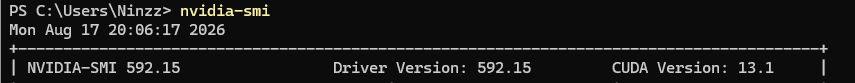
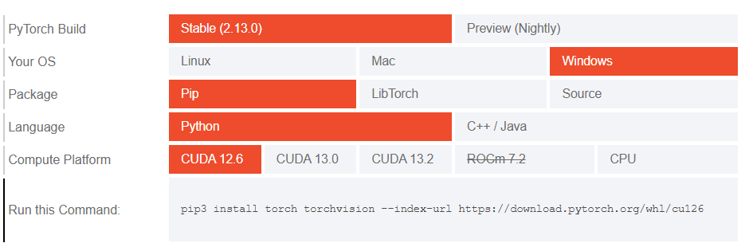
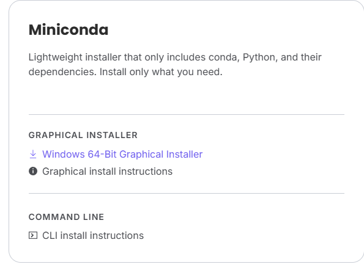

# A Guide For Cliff :>

Install Python and Jupyter extensions in VSCode
Your Python version should be 3.11

Do `py -3.11 -m venv venv` in terminal to create venv

Do `venv\Scripts\activate` _ALWAYS_ when working in Python

Install PyTorch

- run `nvidia-smi` in your terminal
- look for CUDA version
  
- Select build (focus on Compute Platform and find the version that's <= your CUDA version)
  
- install using the command (see _Run This Command_)

Then

```
pip install soundfile librosa pandas numpy` // for processing
pip install wandb scikit-learn` // for general ML
pip install transformers accelerate scipy` // for Meta MMS
pip install elevenlabs python-dotenv
```

`winget install ffmpeg` on your terminal

Install Miniconda https://www.anaconda.com/download/success


Then do

```
conda create -n deepfense python=3.10
conda activate deepfense
pip install deepfense
```
